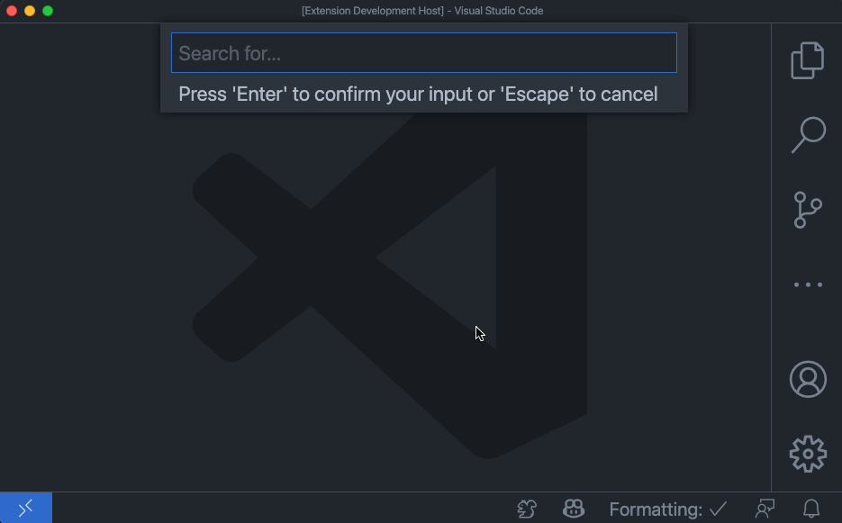

# Simple Web Search

Start a web search from VS Code.

## Features

Type in your search term and a new browser instance or tab will open with your search. It's one less step. That's productivity. 

## Extension Settings

This extension contributes the following settings:

* `simpleWebSearch.searchEngine`: Specify your preferred search engine.

## Known Issues

Too awesome.

## Release Notes

Users appreciate release notes as you update your extension.

### 0.0.1

Just ship it 🐿