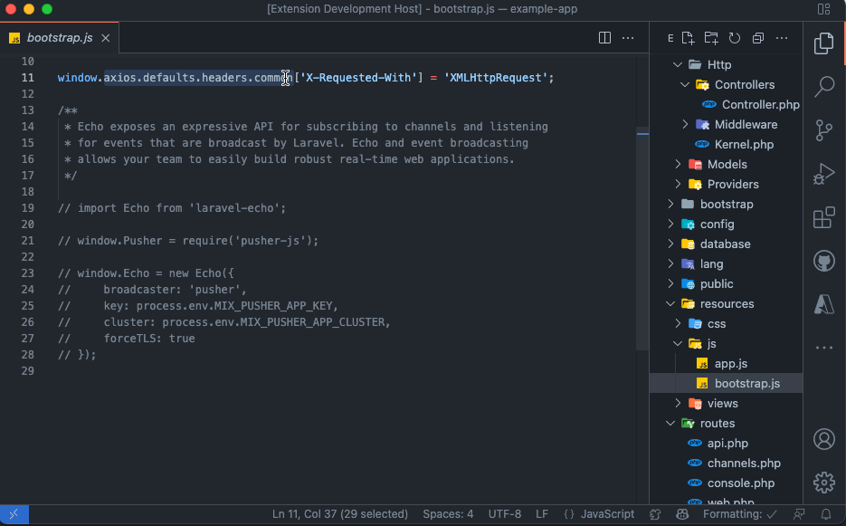

# Simple Web Search

Start a web search from VS Code.

## Features

Type in your search term and a new browser instance or tab will open with your search. It's one less step. That's productivity. 

Search the web for selected text with a nifty right-click.

## Extension Settings

This extension contributes the following settings:

* `simpleWebSearch.searchEngine`: Specify your preferred search engine.

## Known Issues

Too awesome.

## Release Notes

### 0.0.4

So many amazing changes two many...

1. Now search web for selected text with right-click, "Search Web with Selection"
1. Added StackOverflow as a search engine option.

### 0.0.3

With the right logo this time. I SWEAR. You can trust me because I've been right before, just not about this.

### 0.0.2

Made the icon transparent. Googled icon size FROM VS Code. 🐶🍔

### 0.0.1

Just ship it 🐿

